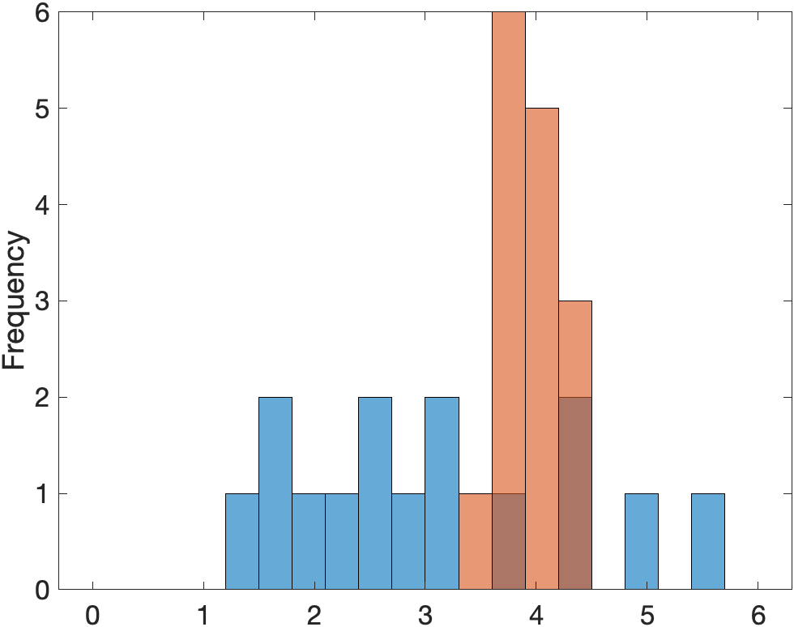
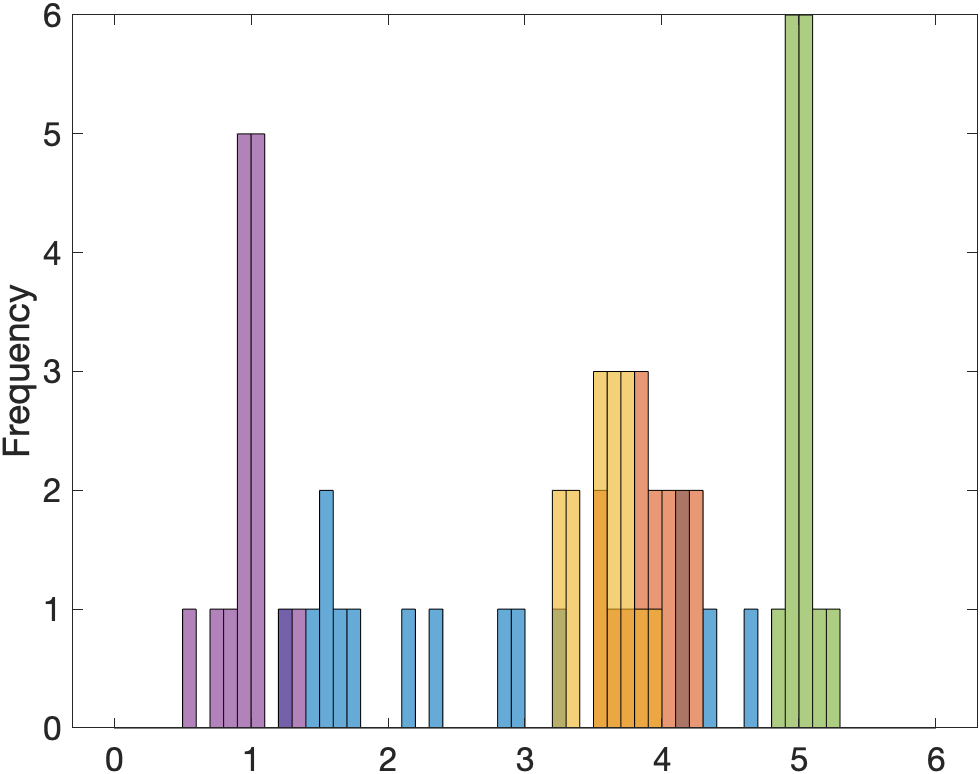

# [plotMultipleHists](https://github.com/tulimid1/plotMultipleHists-matlab/blob/main/plotMutlipleHists.m) 
---

Plot *N* histograms on the same figure with aligned bins. See [multipleHistogramsEX.mlx](https://github.com/tulimid1/plotMultipleHists-matlab/blob/main/multipleHistogramsEX.mlx) for a notebook of given examples. 

## Syntax
---
[plotMultipleHists(varargin)](#a)

## Description
---
### A
plotMultipleHists([varargin](#varargin)) returns a figure with histograms of data vectors from varargin that has aligned bins. [example](#example-1)

## Examples 
---
### Example 1
Plot 2 histograms on the same figure with aligned bins. 

    % generate some random data 
    A = normrnd(3,1, [15, 1]);
    B = normrnd(3.9, 0.2, [15, 1]);
    
    plotMutlipleHists(A, B)
    

    
### Example 2
Plot 5 histograms on the same figure with aligned bins. 

    % generate some random data 
    A = normrnd(3,1, [15, 1]);
    B = normrnd(3.9, 0.2, [15, 1]);
    C = normrnd(3.5, 0.3, [15, 1]);
    D = normrnd(1, 0.2, [15, 1]);
    E = normrnd(5, 0.1, [15, 1]);
    
    plotMutlipleHists(A, B, C, D, E)
    


## Input Arguments
---
### ```varargin```
Data vectors. 

Vectors of data to be plotted as histograms. 

Data Types: (numeric, vector)

## More About 
---


## Tips 
---

This is all this function does (a good function does 1 thing and 1 thing only). You can get the figure and axis after and edit the properties. It does default to a figure font size of 16 so I can see it. 

## Issues and Discussion
---

[Issues](https://github.com/tulimid1/plotMultipleHists-matlab/issues) and [Discussion](https://github.com/tulimid1/plotMultipleHists-matlab/discussions).

If you don't know how to use github (or don't want to), just send me an [email](mailto:tulimid@udel.edu). 
